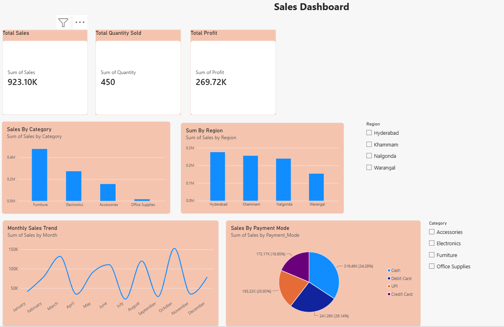

# Sales Dashboard - Power BI

Interactive sales dashboard built in Power BI to analyse sales performance.

## Dashboard

## Key Metrics
- Total Sales: 923.10K
- Total Quantity Sold: 450
- Total Profit: 269.72K

## Visuals
- Sales by Category
- Sales by Region
- Monthly Sales Trend
- Sales by Payment Mode
- Slicers for Region and Category

## Tools Used
Power BI, Excel
